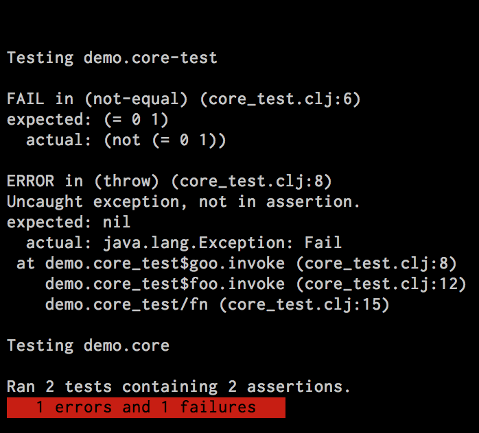

# quickie

[](http://clojars.org/quickie)

A Leiningen plugin that will magically re-run all your tests when a file changes.



## Features

* Uses the builtin clojure.test test runner so you don't need to rewrite your tests
* Tools.namespace will unload and reload namespaces as needed to keep process in sync
* Runs every time a clojure file in your project changes
* Uses (Clansi)[https://github.com/ams-clj/clansi] to show a red or green bar to know if you tests are passing
* Filters out exception stacktraces to remove cruft
* Pass in a test matcher to change which tests are run from the command line.

## Installation

Use this for project-level plugins:

Put `[quickie "0.4.1"]` into the `:plugins` vector of your project.clj.

## Autotest Usage (quickie)

Will rerun your test namespaces as clojure files in your project change

```
lein quickie
```

By default all namespaces in your classpath that contain your project name and end with the word `test` will be tested on each run.  To change this, add a line like this to your project.clj: `:test-matcher #"my regular expression"`.  Alternatively, you can call quickie via the command line with the regex you wish to use: `lein quickie "my-project.*\.test\..*"`.

Hit ctrl+c whenever you are done.  Have fun!

## Parallel Testing Usage (quickp)

Will run your tests across across multiple threads (currently set to 20).

```
lein quickp
```

Running tests against multiple threads could cause test failures. If you use `with-redefs` in your tests you will needs to switch over to something like `with-local-redefs` as seen on [this gist](https://gist.github.com/gfredericks/7143494). 

## License

Copyright © 2015 Jake Pearson

Distributed under the Eclipse Public License, the same as Clojure.

## Contributors
* Adam Esterline
* Jeff Smith
* Russ Teabeault
* Chris Perkins
* Jake Pearson
